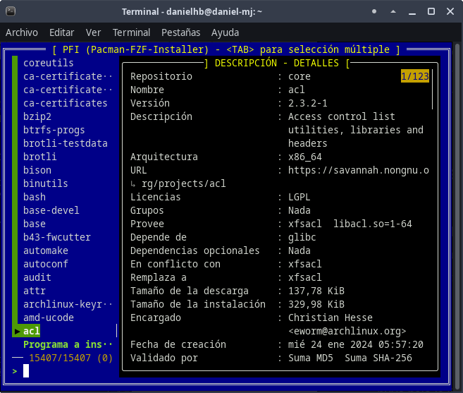

# PFI (Pacman-FZF Installer)

Selector interactivo para la instalación de paquetes en sistemas basados en Arch Linux, utilizando `pacman` con una interfaz mejorada por `fzf`.



## Descripción

Este script combina el poder del gestor de paquetes `pacman` con la interfaz de selección fuzzy `fzf` para crear una experiencia de búsqueda e instalación de paquetes visualmente atractiva y funcional. Permite explorar los repositorios, ver información detallada de los paquetes y seleccionar múltiples paquetes para su instalación.

## Características

- Interfaz interactiva y colorida para la selección de paquetes
- Vista previa de la descripción del paquete
- Listado de archivos que contiene cada paquete
- Selección múltiple de paquetes con la tecla TAB
- Navegación por teclado intuitiva
- Diseño visual personalizado con bordes y colores distintivos

## Requisitos previos

- Sistema operativo basado en Arch Linux (Arch, Manjaro, EndeavourOS, etc.)
- `pacman` (gestor de paquetes predeterminado en Arch)
- `fzf` (selector difuso de línea de comandos)
- `sudo` (para permisos de instalación)

## Instalación

1. Descarga el script:
   ```bash
   https://github.com/danielhb2/pacman-fzf-installer.git
   ```

2. Dale permisos de ejecución:
   ```bash
   chmod +x pfi.sh
   ```

3. Asegúrate de tener las dependencias instaladas:
   ```bash
   sudo pacman -S fzf
   ```

## Uso

Para ejecutar el script:

```bash
./pfi.sh
```

### Controles

- `↑`/`↓` - Navegar por la lista de paquetes
- `TAB` - Seleccionar/deseleccionar paquetes para instalación múltiple
- `ENTER` - Confirmar selección e instalar paquete(s)
- `ESC` - Salir sin instalar
- `CTRL-X` - Subir página en la vista previa
- `CTRL-Z` - Bajar página en la vista previa

## Personalización

El script utiliza una configuración detallada de colores y formato que puedes modificar según tus preferencias:

- Cambia los colores ajustando los parámetros `--color`
- Modifica los estilos de borde con los parámetros `--border`
- Personaliza los iconos de selección (`--pointer`, `--marker`)

## Funcionamiento interno

1. `pacman -Slq`: Lista todos los paquetes disponibles en los repositorios
2. `fzf`: Proporciona una interfaz interactiva para selección
3. Vista previa: Muestra información del paquete (`pacman -Si`) y archivos (`pacman -Fl`)
4. `xargs -ro sudo pacman -S`: Instala los paquetes seleccionados

## Solución de problemas

- **Error: Command not found**: Asegúrate de tener instalado `fzf` (`sudo pacman -S fzf`)
- **Sin permisos de sudo**: Ejecuta el script con un usuario que tenga privilegios sudo
- **Interfaz sin color**: Asegúrate de usar una terminal que soporte colores

## Licencia

Este script se distribuye bajo la licencia MIT. Siéntete libre de modificarlo y distribuirlo.

## Autor

Daniel Horacio Braga

---

*Este instalador es una herramienta no oficial y no está afiliado con el proyecto Arch Linux.*  

*README redactado por Anthropic Claude, chatbot.* -  https://www.anthropic.com/claude
